layout: true
  
<div class="my-footer"><span>Qiao-Guo Tan/CEE/XMU | tanqg@xmu.edu.cn | 2025-Apr-10   
&emsp;&emsp;&emsp;&emsp;&emsp;&emsp;&emsp;&emsp;&emsp;&emsp;&emsp;&emsp;&emsp;
&emsp;&emsp;&emsp;&emsp;&emsp;&emsp;&emsp;&emsp;&emsp;&emsp;&emsp;&emsp;&emsp;
</span></div> 


---
## 皮尔逊（Pearson）相关性分析的假设条件    

* .large[ 两个变量都是定比或定距变量]  
<br>
* .large[ 两个变量数据都呈正态分布]  
<br>
* .large[ 数据中没有异常值]  
<br>
* .large[ 数据来自一个随机或代表性样本]  
<br>
* .large[ 预期两个变量之间存在线性关系]   

---
## 数据分类：定类、定序、定距、定比


```{r echo=FALSE, out.width=2104/2.4, out.height=1112/2.4}
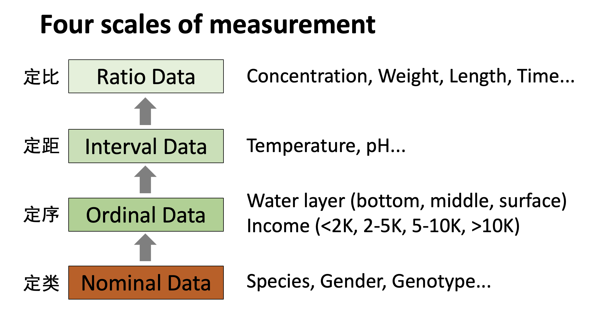
```


---
## 相关性分析方法的分类和选择     

<br>

名称  | 相关系数|应用场合|计算方法
------|----------------------
Pearson| *r*  |变量呈正态分布| $r=\frac{\text{cov}_{xy}}{s_xs_y}=\frac{\sum(x_i-\bar{x})(y_i-\bar{y})}{(N-1){s_xs_y}}$
Spearman| $\rho$  |变量非正态分布|将数据从小到大排序，<br>用序号进行Pearson相关性分析<br>
Kendall| $\tau$ |数据量小,<br>变量非正态分布，<br> 变量存在较多相同值|将数据从小到大排序，<br>计算一致对的数量（ $C$，两个变量的相对排序一致）和不一致对的数量（ $D$，两个变量的相对排序不一致）， $\tau = (C-D)/(C+D)$ 


---

## 相关系数*r*：能度量什么？不能度量什么？    

.pull-left[
```{r echo=FALSE, out.width=2560/5, out.height=1169/5}
knitr::include_graphics("figs/wiki_cor_1.png")
```
]

.pull-right[

- .large[ *r*能度量.red[线性]关系的.red[强弱]和.red[方向]  
（第1行）]  

- .large[ *r*.red[不能]度量线性关系.red[斜率]的大小  
（第2行）]  

- .large[ *r*.red[不能]度量.red[非线性]关系的强弱  
（第3行）]  
]

.footnote[https://en.wikipedia.org/wiki/Correlation_and_dependence]

---
## *r*值反映相关性强弱，正负反映方向  

- .large[相关系数（*r*）在-1～+1之间]  
<br>
- .large[*r* = +1表示两个变量完美正相关，*x*增加，则*y*等比例增加；]  
<br>
- .large[*r* = -1表示两个变量完美负相关，*x*增加，则*y*等比例减少；]  
<br>
- .large[ *r* = 0表示两个变量之间不相关，*x*增加，*y*随机增减。]  
<br>

---

## 数据分析之前的可视化很重要  
.pull-left[
```{r echo=FALSE, out.width=2666/6, out.height=2113/6}
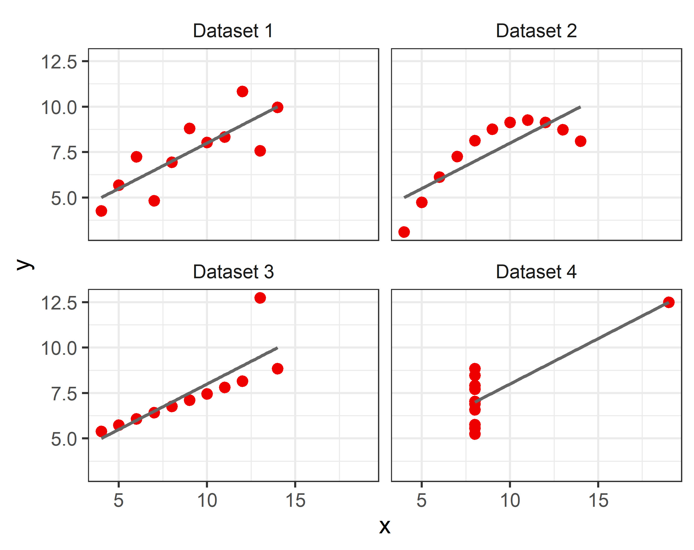
```
]

.pull-right[

- 左图是著名的安斯库姆四重奏（Anscombe's quartet），四组数据具有：
  * 相同的*x*均值：9  
  * 相同的*x*方差：11  
  * 相同的*y*均值：7.5  
  * 相同的*y*方差：4.12  
  * 相同的最优拟合线：*y* = 3 + 0.5*x*  
  * .red[相同的相关系数*r*：0.816]  

- *r*度量两个变量.red[线性]关系的.red[强弱]  
- 非线性关系无法用*r*很好地度量  

- 不要迷信统计分析，数据可视化很重要
]


.footnote[https://en.wikipedia.org/wiki/Anscombe%27s_quartet]


---
## 了解数据

```r
?iris
```

> **Edgar Anderson's Iris Data**  

> This famous (Fisher's or Anderson's) iris data set gives the measurements in centimeters of the variables sepal length and width and petal length and width, respectively, for 50 flowers from each of **3 species of iris**. The species are **Iris setosa**, **versicolor**, and **virginica**.

```{r echo=FALSE, out.width=1765/2.4, out.height=658/2.4}


```
---

## 了解数据 

.pull-left67[
```{r}
str(iris)
```
]

.pull-right67[
- Sepal.Length： 萼片长度  
- Sepal.Width：萼片宽度  
- Petal.Length：花瓣长度  
- Petal.Width：花瓣宽度  
- Species：*Iris setosa*, *I. versicolor*, *I. virginica*
]

---

## 花瓣(Petal) vs. 萼片(Sepal). 
```{r echo=FALSE, out.width=1361/1.3, out.height=617/1.3}
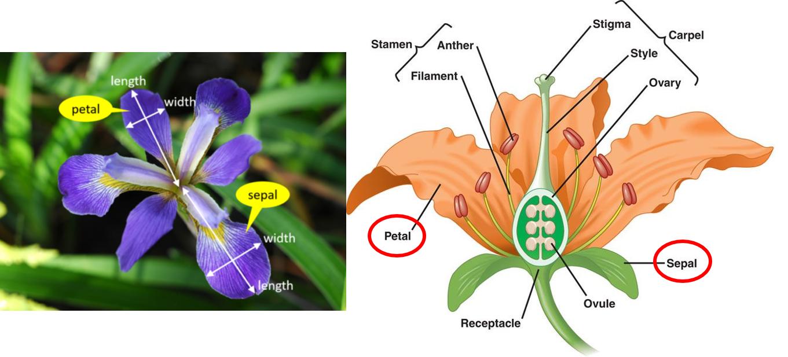

```

---

## 了解数据：作散点图 


```r 
plot(iris[,-5], col = rep(1:3, each = 50)) #删去iris数据表的第5列，作两两散点图

```
```{r echo=FALSE, out.width=3800/7, out.height=3180/7}

#png("figs/iris_1.png", width = 3800, height = 3180, res = 600)
#plot(iris[,-5], col = rep(1:3, each = 50)) 
#dev.off()

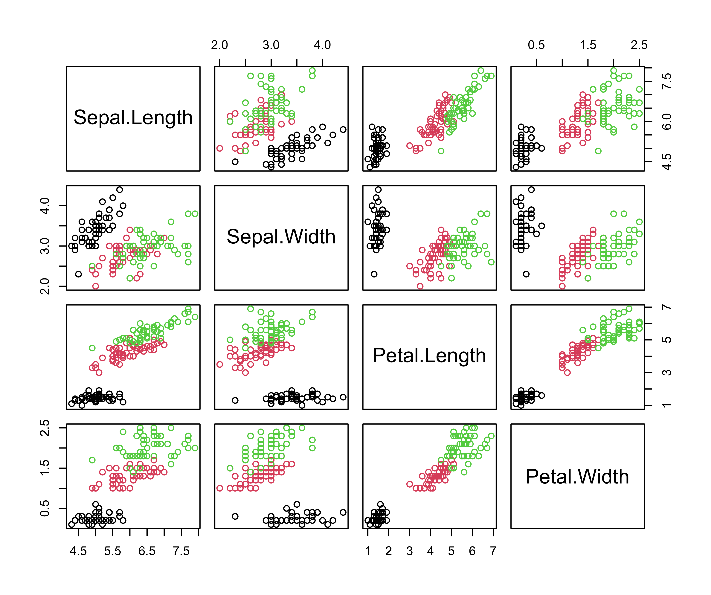

```


---
class: inverse, center, middle

## 如何做Pearson相关性分析  


---

## 花瓣长度与宽度之间的相关性  

### 1. 筛选数据（以弗吉尼亚鸢尾为例）  
```{r}
iris_virg <- subset(iris, Species == "virginica")
```

---

### 2. 检验正态分布：用函数`shapiro.test()`    

.pull-left[
```{r highlight.output=c(5)}
shapiro.test(iris_virg$Petal.Width)
```
]

.pull-right[
```{r highlight.output=c(5)}
shapiro.test(iris_virg$Petal.Length)
```
]

**结果解读：** 两个正态分布检验的*p* > 0.05, 接受原假设（null hypothesis），弗吉尼亚鸢尾花瓣长度、宽度数据符合正态分布，能直接进行Pearson相关性分析

---

### 3. 计算相关系数：函数`cor()`  
 
* 了解函数`cor()`
```r
?cor 
```

> `cor(x, y = NULL, use = "everything", method = c("pearson", "kendall", "spearman"))`

---

### 3. 计算相关系数：函数`cor()`  

```{r}
cor(iris_virg$Petal.Length, iris_virg$Petal.Width) #默认进行Pearson相关性分析
```

--
- **结果表述**：弗吉尼亚鸢尾花瓣长度与宽度之间的相关系数（*r*）为0.322    
- 相关系数的大小反映相关性的强弱（相关系数即effect size）
--
<br >
<br >
- **问题**：相关性是否显著？  


---

### 4. 检验相关性是否显著：用函数`cor.test()`    
* 用函数`cor.test()`计算相关系数，并给出置信区间、显著性水平等信息     
* 了解函数`cor.test()`
```r
?cor.test() 
```
> `cor.test(x, y, alternative = c("two.sided", "less", "greater"), method = c("pearson", "kendall", "spearman"), exact = NULL, conf.level = 0.95, continuity = FALSE, ...)`


---

### 4. 检验相关性是否显著：用函数`cor.test()`     

```{r, highlight.output=c(5, 8, 11)}
cor.test(iris_virg$Petal.Length, iris_virg$Petal.Width)

```

--
- 显著性检验结果（p-value）：0.02254
- 相关系数的95%置信区间（95 percent confidence interval）：0.0480704 0.5510499 （注意：置信区间的上下限都大于0，这也表明显著“正”相关）
- 相关系数（cor）：0.3221082  

- **结果表述**：弗吉尼亚鸢尾的花瓣长度与花瓣宽度显著相关（*r* = 0.322，*p* = 0.023）。
---


### 5. 提取相关性分析及显著性检验的信息  

- 将检验结果存入变量`test_virg`  
```{r}
test_virg <- cor.test(iris_virg$Petal.Length, iris_virg$Petal.Width)
```

<br />

- 查看结果里储存了哪些信息？  
```{r}
names(test_virg)
```

---

### 5. 提取相关性分析及显著性检验的信息    

- 提取*p*值  
```{r}
test_virg$p.value
```

<br />

- 提取*r*值

```{r}
test_virg$estimate
```

---

### 6. 将相关性分析的结果添加到图上  

- 自动获取*r*值和*p*值，生成标注的表达式  
  *  目标：得到表达式`"atop(italic(r) == 0.322 , italic(p) == 0.023 )"` 
  *  `atop()`的作用是将文字分成两行显示 （?atop了解更多） 

- 以下代码看上去繁琐，但就是在“拼凑”出以上的目标表达式  

```{r}
label_rp <- paste("atop(",
                  "italic(r)",
                  "==",
                  deparse(sprintf("%.3f", test_virg$estimate)), #注意将test_virg替换为实际采用的变量名，下同
                  ",",
                  "italic(p)",
                  ifelse(test_virg$p.value<0.001, #判断p是否<0.001
                         "< 0.001",  #是则显示"< 0.001"
                         paste("==",deparse(sprintf("%.3f", test_virg$p.value)))), #否则显示实际值
                  ")"  )
label_rp
```

???
mpg %>% 
  ggplot(aes(displ, hwy))+
  theme_classic()+
  geom_point()+
  facet_grid(drv~.)+
 # annotation_logticks(sides = "l")
  annotate(geom = "text", 
           x = 6, y = 30,
           parse = T,
           label = paste("italic(p) == ", deparse(sprintf("%.3f", 0.480))))
           
---

### 6. 将相关性分析的结果添加到图上   


.pull-left[
```{r warning=F, message=F}
library(ggplot2)
```


```r
ggplot(iris_virg, aes(Sepal.Length, Sepal.Width))+
  theme_bw()+
  geom_point(color = "red2")+
  geom_smooth(method = "lm", se = F, size = 0.7, color = "tomato")+
  labs(x = "Sepal length (cm)",
       y = "Sepal width (cm)",
       title = ~italic("Iris virginica"))+
  annotate(geom = "text", x = 5, y = 3.5, hjust = 0, label = label_rp, parse = T) #添加r和p值信息, hjust = 0表示左对齐 
```
]

.pull-right[
```{r echo=FALSE, out.width=332*1.2, out.height=304*1.2}
#ggsave("figs/iris_2.png", width = 332/90, height = 304/90, dpi = 600)
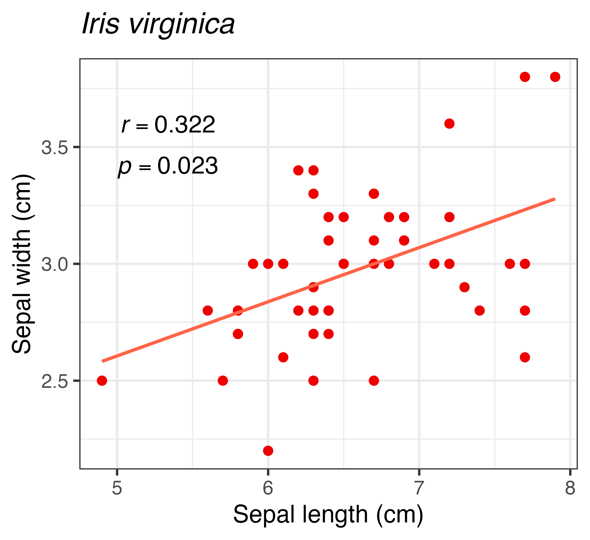

```
]


---
### 针对矩阵进行两两相关性分析  

* 进行两两相关性分析，得到相关系数矩阵
```{r}
cor(iris_virg[,-5]) #删去第5列（物种名称列） 
```


---
class: inverse, center, middle

## 如何做非参数相关性分析  


---

## 数据不符合正态分布，需做非参数相关性分析 

### 以山鸢尾为例  

```{r}
iris_seto <- subset(iris, Species=="setosa") #提取物种setosa的数据
```

.pull-left[
```{r}
shapiro.test(iris_seto$Petal.Width)
```
]

.pull-right[
```{r}
shapiro.test(iris_seto$Petal.Length)
```
]

**结果解读：** 花瓣宽度正态分布检验的*p* < 0.05, 拒绝null hypothesis，山鸢尾花瓣宽度数据不符合正态分布，不能直接进行Pearson相关性分析

---

### 问题：数据不满足正态分布，怎么做相关性分析？
- .large[非参数方法：`Spearman`、`Kendall`]  
<br>
- .large[数据转化（例如，取对数）]  

---

### 非参数相关性分析-1：Spearman相关性分析   

```{r}
cor(iris_seto$Petal.Length, iris_seto$Petal.Width, method = "spearman") 
cor.test(iris_seto$Petal.Length, iris_seto$Petal.Width, method = "spearman") 
```

- **结果表述**：山鸢尾的花瓣长度与花瓣宽度无显著相关性（ $\rho$ = 0.271，*p* = 0.057）。

---

### 非参数相关性分析-2：Kendall相关性分析 

```{r}
cor(iris_seto$Petal.Length, iris_seto$Petal.Width, method = "kendall")
cor.test(iris_seto$Petal.Length, iris_seto$Petal.Width, method = "kendall")
```

- **结果表述**：山鸢尾的花瓣长度与花瓣宽度无显著相关性（ $\tau$ = 0.222，*p* = 0.060）。


???

```{r}
iris_vers <- subset(iris, Species=="versicolor")
shapiro.test(iris_vers$Petal.Width)
shapiro.test(iris_vers$Petal.Length)

cor(iris_vers$Petal.Length, iris_vers$Petal.Width)
```

---

### 三个物种一并分析    


.pull-left[
```{r highlight.output=c(5)}
shapiro.test(iris$Petal.Length)
```
]

.pull-right[
```{r highlight.output=c(5)}
shapiro.test(iris$Petal.Width)
```
]

**结果解读：** *p* < 0.05, 拒绝null hypothesis，三种鸢尾花放在一起，花瓣长度、宽度数据均不符合正态分布，不能直接进行Pearson相关性分析


---

### 三个物种一并分析：非参数相关性分析    


```{r}
cor.test(iris$Petal.Length, iris$Petal.Width, method = "spearman")
```
- **结果表述**：花瓣长度与花瓣宽度之间存在强相关性（ $\rho$ = 0.938, *p* < 0.01）。

---

### 三个物种一并分析：非参数相关性分析    


```{r}
cor.test(iris$Petal.Length, iris$Petal.Width, method = "kendall")
```
- **结果表述**：花瓣长度与花瓣宽度之间存在强相关性（ $\tau$ = 0.807, *p* < 0.01）。

* 对比一下：`cor(iris$Petal.Length, iris$Petal.Width)`  


---
class: inverse, center, middle

## 如何选择单侧、双侧检验？    


---

## 相关系数的显著性检验：单侧 vs. 双侧
`cor.test(x, y, alternative = c("two.sided", "less", "greater"), method = c("pearson", "kendall", "spearman"), exact = NULL, conf.level = 0.95, continuity = FALSE, ...)`

---

### 单侧还是双侧，如何选择？

* 对正相关或负相关没有预期，选双侧：`alternative = "two.sided"`    
 - 回答问题：两变量之间是否存在相关性？  
 - 备择假设： $r≠ 0$

* 预期正相关，选单侧：`alternative = "greater"`  
 - 回答问题：两变量之间是否存在正相关？  
 - 备择假设： $r> 0$

* 预期负相关，选单侧：`alternative = "less"`
  - 回答问题：两变量之间是否存在负相关？  
  - 备择假设： $r< 0$

### 注意：
* 选择单侧检验需要充足的理由  
* 仅仅为了获得显着性而选择单侧检验是不合适的  
* 在运行双侧检验后，未能拒绝零假设，转而选择单侧检验是不合适的  

---

### 相关系数的显著性检验：单侧 vs. 双侧（以山鸢尾为例）  

### 默认双侧检验   

```{r}
cor.test(iris_seto$Petal.Length, iris_seto$Petal.Width, method = "spearman") 
```
**结果**：山鸢尾的花瓣长度与花瓣宽度无显著相关性（ $\rho$ = 0.271, 双侧*p* = 0.057）

---

### 相关系数的显著性检验：单侧 vs. 双侧（以山鸢尾为例）  

### 选择单侧检验  

```{r}
cor.test(iris_seto$Petal.Length, iris_seto$Petal.Width, alternative = "greater", method = "spearman") #p值减小一半
```

**结果**：山鸢尾的花瓣长度与花瓣宽度显著正相关（ $\rho$ = 0.271, 单侧*p* = 0.028） 


---
class: inverse, center, middle

## 相关性强弱如何相互比较？  


---

## 相关性强弱如何相互比较？

#### 三种鸢尾的花瓣长度和宽度的相关性强弱有显著差异吗？
```{r}
#cor(iris_seto$Petal.Length vs. iris_seto$Petal.Width)
r1 = 0.33163 
#cor(iris_vers$Petal.Length, iris_vers$Petal.Width)
r2 = 0.7866681
#cor(iris_virg$Petal.Length, iris_virg$Petal.Width)
r3 = 0.3221082
```


---

## 相关性强弱如何相互比较？  

#### 使用`cocor`程序包的`cocor.indep.groups()`函数   
```{r warning=FALSE, message=FALSE}
library(cocor)
```

```r
?cocor.indep.groups
```

`cocor.indep.groups(r1.jk, r2.hm, n1, n2, alternative = "two.sided",
  test = "all", alpha = 0.05, conf.level = 0.95, null.value = 0,
  data.name = NULL, var.labels = NULL, return.htest = FALSE)`

---
## 相关性强弱如何相互比较？

- 以iris_seto（r1 = 0.33163，样本数n1=50）和iris_vers（r2 = 0.7866681，样本数n2=50）为例  

```{r, highlight.output=c(11,12)}
cocor.indep.groups(0.33163, 0.7866681, n1=50, n2=50, alternative="less")
```

**结果解读**：山鸢尾花瓣长和花瓣宽的相关性显著低于变色鸢尾（Fisher's Z-test，*p* < 0.001）。


---
class: inverse, center, middle

## 如何做偏相关分析？  

---

## 偏相关分析 - 何时需要？  

```{r}
mpg2 <- mpg[,c("displ","cyl","hwy")] #仅选取mpg数据表的这3列
```

```r
plot(mpg2)
```
.pull-left[
```{r echo=FALSE, out.width=3057/6, out.height=1977/6}
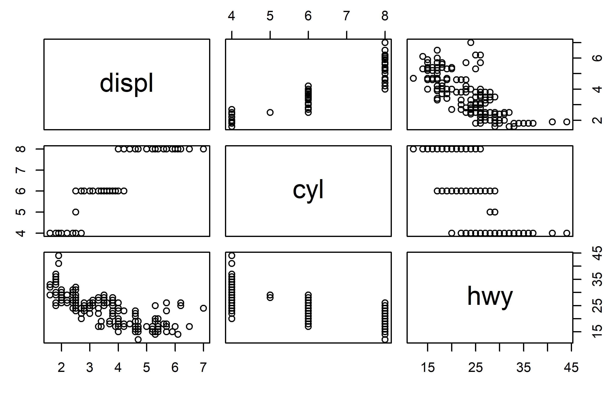

```

]

.pull-right[

- **问题**：汽车的高速公路每加仑英里数（hwy）与排量（displ）呈负相关，同时排量（displ）与发动机缸数（cyl）呈正相关。如果排除缸数的影响，每加仑英里数与排量仍然负相关吗？  
<br />  

- 这需要**偏相关分析**：控制缸数，分析每加仑英里数与排量的相关性  
]


---
## 偏相关分析 - 如何做？

- **需用要ggm程序包中的pcor()函数**  

```{r}
library(ggm)
```

- 了解`pcor()`函数  

```r
?pcor
```
>** `pcor(u, S)  `**  
>  .red[**u**]	 a vector of integers of length > 1. **The first two** integers are the indices of variables the correlation of which must be computed. **The rest** of the vector is the conditioning set .red[ (前两个是进行相关性分析的变量，从第三个开始是控制变量)]  

>  .red[**S**]	 a symmetric positive definite matrix, a sample covariance matrix .red[(协方差矩阵)]  

`pcor(c("变量1", "v变量2", "控制变量1", "控制变量2" etc.), var(dataframe))`
---
## 偏相关分析  

```{r}
#相关性分析  
cor(mpg2$hwy, mpg2$displ)
#偏相关分析  
pcor(c("hwy", "displ", "cyl"), var(mpg2))  #var()函数计算协方差矩阵
```
- **结果解读**：`hwy`和`displ`的相关系数为-0.766，若控制`cyl`变量进行偏相关分析，相关系数降低为-0.241  


---
## 偏相关分析的显著性检验  

- 需使用`pcor.test()`函数  

> pcor.test(r, q, n)    
>  r：  a partial correlation coefficient, computed by pcor（偏相关分析得到的相关系数）  
>  q：  the number of variables in the conditioning set（控制变量数）  
>  n：  integer > 0, the sample size（样本数）  

```{r}
pc <- pcor(c("hwy", "displ", "cyl"), var(mpg2))
pcor.test(pc, 1, 234) #1是控制变量数（即cyl这1个控制变量），234是样本数  

```

- **结果表述**：控制缸数变量，油效和排量之间仍存在显著的负相关性（*r* = -0.241，*p* < 0.001）。  

---
## “高级的”相关性分析


.pull-left[
```{r message=FALSE, warning=FALSE}
library(energy)     # For distance correlation
library(minerva)    # For MIC
library(Hmisc)      # For Hoeffding's D
library(infotheo)   # For mutual information

set.seed(123)
x <- rnorm(100)   # Random normal data
y <- x^2 + rnorm(100, sd=0.1)  # Nonlinear relationship
```
]


.pull-right[

```r
plot(x, y)
```

```{r echo=FALSE, out.width=375, out.height=371}
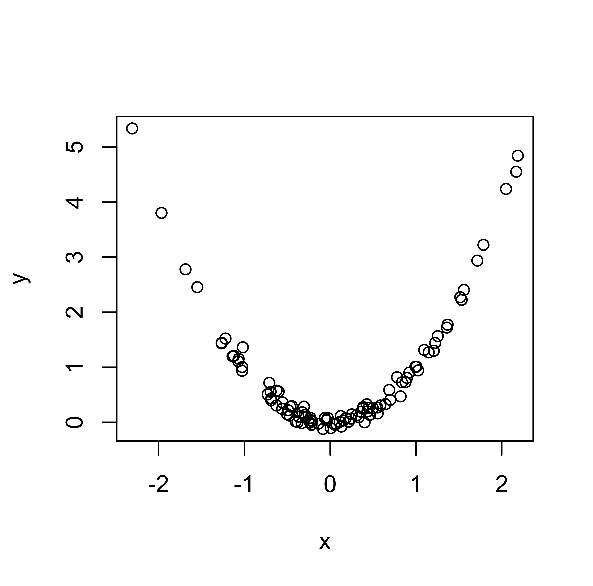

```

]


---
## “高级的”相关性分析 
```{r}
# Pearson Correlation (for reference)
pearson_cor <- cor(x, y, method = "pearson")

# Spearman Correlation (for reference)
spearman_cor <- cor(x, y, method = "spearman")

# Kendall's Tau  (for reference)
kendall_tau <- cor(x, y, method = "kendall")

# Distance Correlation
dist_cor <- dcor(x, y)

# Maximal Information Coefficient (MIC)
mine_result <- mine(x, y)
mic_value <- mine_result$MIC

# Hoeffding’s D statistic
hoeffding_d <- hoeffd(x, y)$D[1,2]

# Mutual Information
mutual_info <- mutinformation(discretize(x), discretize(y))
```

---
## “高级的”相关性分析 

```{r}
# Display results
results <- data.frame(
  Method = c("Pearson", "Spearman", "Kendall's Tau", "Distance Correlation", "MIC",  "Hoeffding’s D", "Mutual Information"),
  Value = c(pearson_cor, spearman_cor, kendall_tau, dist_cor, mic_value,  hoeffding_d, mutual_info)
)

print(results)

```

---
## “高级的”相关性分析 - 优缺点比较

```{r echo = F}

# Create the data frame
results_table_cn <- data.frame(
  方法 = c("距离相关性 (Distance Correlation)", "最大信息系数 (MIC)", 
          "霍夫丁统计量 (Hoeffding’s D)", "互信息 (Mutual Information)"),
  优势 = c("检测任何相关性，包括线性和非线性", 
          "可捕捉多种关系，包括周期性",
          
          "检测一般相关性，而不仅仅是单调关系",
          "衡量任何类型的依赖关系，不仅限于相关性"),
  局限性 = c("计算量较大", 
            "可能会在小样本中过拟合", 
           
            "较少被使用", 
            "绝对数值难以解释")
)


knitr::kable(results_table_cn, format = "markdown")

```


---
class: inverse, center, middle

## 相关性分析的可视化  

---

## 可视化：`GGally`程序包的`ggairs()`函数  
.pull-left[
```{r message=F}
library(GGally) 
d_setosa <- subset(iris, Species=="setosa") #筛选山鸢尾setosa数据

```

```r
# 两两相关性的可视化  
ggpairs(d_setosa)
```
]

.pull-right[

```{r echo=FALSE, out.width=3986/8, out.height=3240/8}
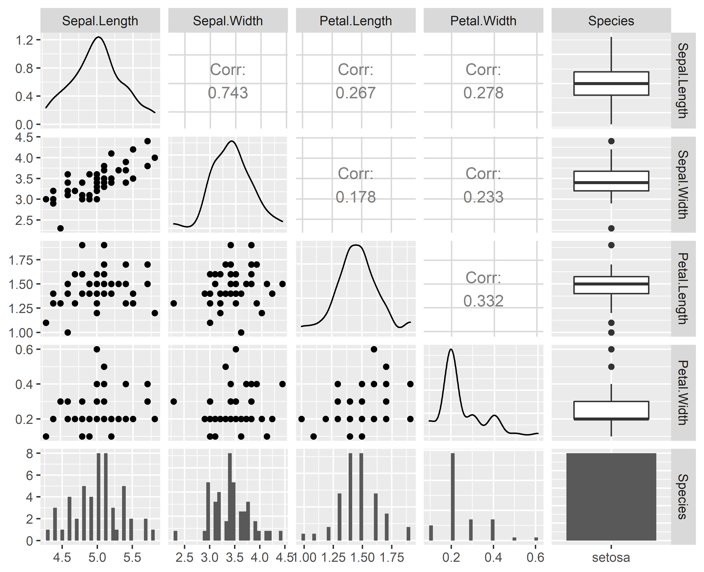

```
]


---

## 可视化：`GGally`程序包的`ggairs()`函数   
.pull-left[

```r
# 全部数据两两相关性的可视化  
ggpairs(iris, aes(color=Species))
```
]

.pull-right[

```{r echo=FALSE, out.width=3986/7.6, out.height=3240/7.6}
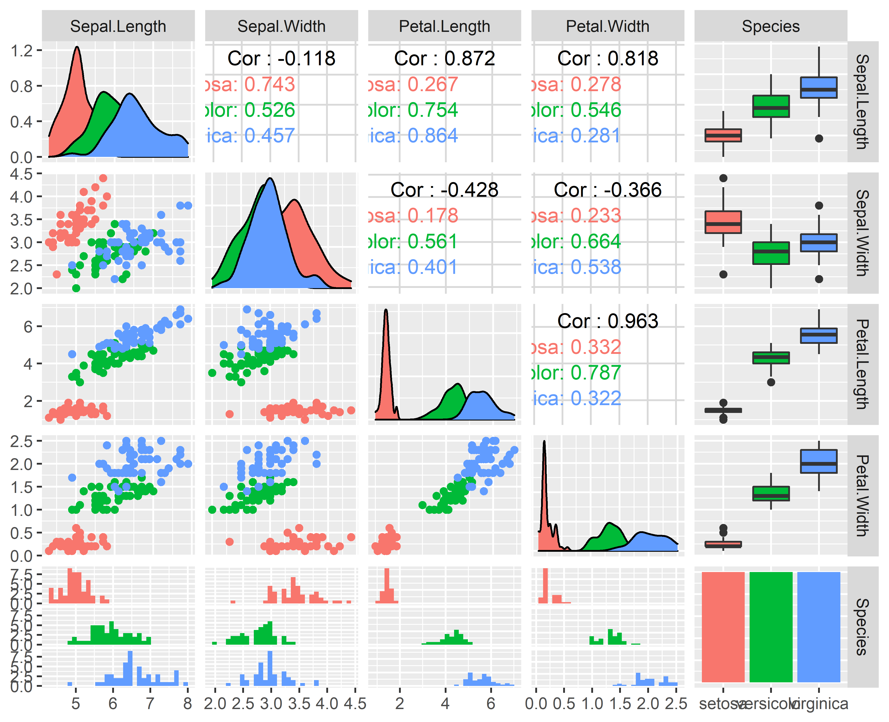

```
]

.footnote[更多信息：https://ggobi.github.io/ggally/#ggallyggpairs]

---

## 可视化：`GGally`程序包的`ggcorr()`函数  


.pull-left[

```{r message=F}
library(GGally)
mtcars2 <- mtcars[,c("mpg", "disp","hp","drat","wt","qsec" )] #筛选数据  
```

```r
ggcorr(mtcars2, palette = "RdBu", label = TRUE, label_round = 2, label_size = 3.5, label_color = "black")

```
]

.pull-right[

```{r echo=FALSE, out.width=2420/5, out.height=2000/5}
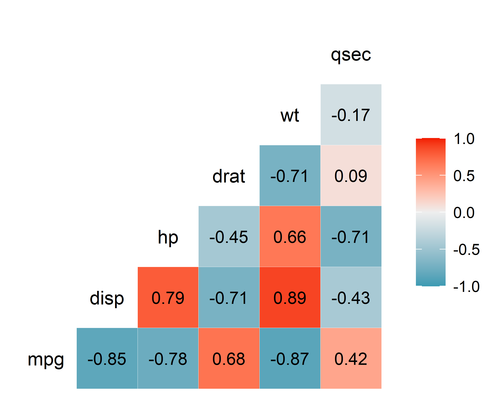
```
]


.footnote[ggcorrg更多信息： https://briatte.github.io/ggcorr/]

---

## 可视化：`GGally`程序包的`ggcorr()`函数

.pull-left[
```r
ggcorr(mtcars2, geom = "circle")
```
]

.pull-right[
```{r echo=FALSE, out.width=2260/4.5, out.height=1693/4.5}
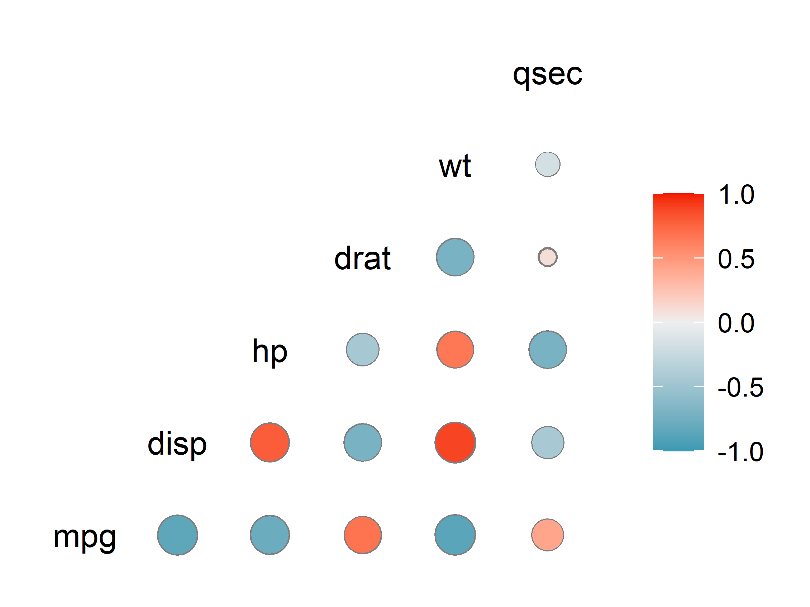

```
]

---

## 可视化：`ggcorrplot`程序包的`ggcorrplot()`函数

.pull-left[
```{r}
library(ggcorrplot)
corr <- round(cor(mtcars2), 2) #计算相关系数，取2位小数
p.mat <- cor_pmat(mtcars2) #计算显著性检验p值  
```

```r
ggcorrplot(corr, hc.order = TRUE, type = "lower",p.mat = p.mat,
   lab = TRUE,colors = c("#6D9EC1", "white", "#E46726"))
```
]

.pull-right[
```{r echo=FALSE, out.width=388, out.height=302}
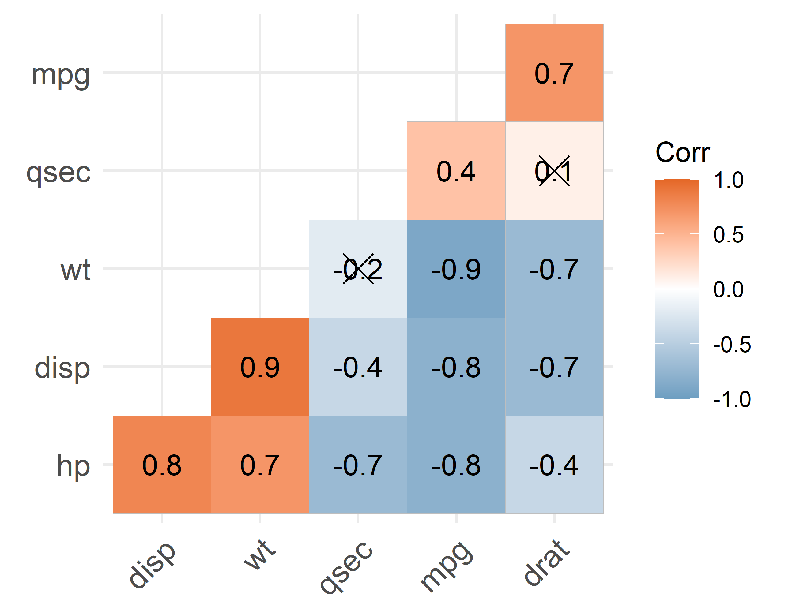

```
]

.footnote[ggcorrg更多信息： http://www.sthda.com/english/wiki/ggcorrplot-visualization-of-a-correlation-matrix-using-ggplot2]
---

## 可视化：`correlation`程序包

.pull-left[
```{r message=F}
library(dplyr)
library(correlation)
library(ggraph)
```


```r
mtcars2 |>  
  correlation(partial = T) |>  #偏相关
  plot()+
  scale_edge_color_continuous(low = "#38972A", high = "#B2363D")

```
]
.pull-right[
```{r echo=FALSE, out.width=445, out.height=343}

#ggsave("figs/vis_3.png", width = 445/90, height = 343/90, dpi = 900)
knitr::include_graphics("figs/vis_3.png")

```
]


.footnote[更多信息：https://www.r-bloggers.com/the-ulimate-package-for-correlations-by-easystats/]


---

### 相关性分析的可视化：其他网络资源

- An Introduction to `corrplot` Package  
https://cran.r-project.org/web/packages/corrplot/vignettes/corrplot-intro.html  
多种作图方式  

- Network plot of a `correlation` data frame  
https://corrr.tidymodels.org/reference/network_plot.html 
用网络图展示相关性矩阵  

---

## 内容小结  
.pull-left[
**相关性分析（Pearson）**  
- 函数： 
  * 相关性分析`cor()`  
  * 显著性检验`cor.test()`  
  * 相关性强弱相互比较`cocor::cocor.indep.groups()`  

**非参数相关性分析**  
- Spearman：`cor(...method = "spearman"...)`  
- Kendall：`cor(...method = "kendall"...)`  

**偏相关分析**  
- 相关系数`ggm::pcor()`
- 显著性分析`ggm::pcor.test()`
]

.pull-right[
**单侧vs.双侧显著性检验**  
- 双侧：`cor.test(...alternative ="two.sided"...)`  
- 单侧：
  * 负相关：`cor.test(...alternative ="less"...)`     
  * 正相关：`cor.test(...alternative ="greater"...)`   

**相关性分析可视化**
- `GGally::ggairs()`：散点图矩阵、分布曲线、相关系数等  
- `GGally::ggcorr()`：相关系数矩阵热图
- `ggcorrplot::ggcorrplot()`：相关系数矩阵热图，带显著性检验信息  
- `correlation::correlation()`：相关系数网络图
]
---

## 阅读作业：
.large[Field, Andy, Jeremy Miles, and Zoë Field. Discovering statistics using R. Sage publications, 2012. Chapter 6 Correlation. (不需看R Commander相关内容)]


